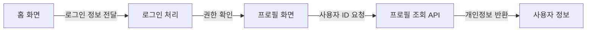
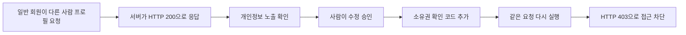

# VibeCheck

> 앱을 배포하기 전에, **내 서비스에서 개인정보가 새지 않는지 직접 확인**하는 도구입니다.

VibeCheck는 어려운 보안 점수만 보여주지 않습니다. GitHub 저장소나 테스트 앱을 분석해 서비스가 어떻게 연결되어 있는지 보여주고, 문제가 의심되는 연결을 사람이 이해할 수 있는 말로 알려줍니다.

예를 들어 “다른 사람의 프로필을 볼 수 있음”, “개인정보가 콘솔에 표시될 수 있음”, “외부 주소로 데이터가 전달될 수 있음”처럼 보여줍니다.

## 무엇을 할 수 있나요?

### 1. GitHub 저장소를 넣어 서비스 지도를 만듭니다

공개 GitHub 저장소 주소를 넣으면 VibeCheck가 코드를 읽고 아래처럼 서비스 기능을 정리합니다.



코드 파일을 전부 늘어놓지 않습니다. `로그인`, `프로필 조회`, `데이터 저장`, `외부 서비스 연동`처럼 **사용자가 이해할 수 있는 기능 단위**로 묶습니다.

각 선은 “어떤 정보가 어디로 이동하는지”를 뜻합니다. 빨간 선은 실제 정적 분석 결과를 바탕으로 추가 확인이 필요한 연결입니다.


빨간 선을 누르면 어떤 코드에서 확인됐는지, 무엇이 문제일 수 있는지, 어떤 데이터를 확인해야 하는지를 볼 수 있습니다.

### 2. 실제 공격으로 확인하는 Golden Demo

로컬 데모에서는 단순 분석을 넘어 실제 요청으로 보안 문제를 확인합니다.



데모에서 확인하는 문제는 간단합니다.

1. 일반 회원 `member01`이 다른 회원 `member02`의 프로필을 요청합니다.
2. 처음에는 서버가 정보를 보내 줍니다. (`HTTP 200`)
3. VibeCheck는 “내 정보만 볼 수 있어야 한다”는 약속이 지켜지지 않았다고 알려줍니다.
4. 사람이 수정안을 승인하면, 다른 사람 정보를 요청했을 때 막도록 코드를 고칩니다.
5. **똑같은 요청**을 다시 보내 `HTTP 403`으로 차단됐는지 확인합니다.

즉, **문제 발견 → 사람 승인 → 수정 → 같은 방법으로 다시 확인**까지 하나의 흐름으로 보여줍니다.

## 화면은 이렇게 읽으면 됩니다

- **서비스 보안 지도**: 내 앱의 기능과 정보 이동 경로
- **일반 선**: 코드에서 확인된 정상 연결
- **빨간 선**: 보안 점검이 필요한 연결
- **확인된 위험**: 기술 용어 대신 어떤 일이 생길 수 있는지 요약
- **재검증 결과**: 수정 전과 후가 어떻게 달라졌는지 비교

VibeCheck는 “취약점 22개”처럼 끝내지 않습니다. 사용자가 먼저 알아야 할 것은 **어디에서 어떤 정보가, 왜 위험할 수 있는지**입니다.

## 실행 방법

먼저 필요한 패키지를 설치합니다.

```bash
npm install
npm run setup:semgrep
```

그 다음 서버를 실행합니다.

```bash
npm start
```

브라우저에서 [http://localhost:3000](http://localhost:3000)을 엽니다.

`public/index.html` 파일을 직접 열면 화면이 제대로 나오지 않을 수 있으니, 반드시 `npm start`로 실행하세요.

작동 확인은 다음 명령으로 할 수 있습니다.

```bash
npm test
```

## 안전하게 사용하는 방법

- 공개 GitHub 저장소 분석은 코드를 **읽기 전용으로 가져와 분석**합니다.
- 외부 서비스에 임의의 공격 요청을 보내지 않습니다.
- 실제 공격과 수정·재검증은 승인된 로컬 Golden Demo 또는 사용자가 연결한 테스트 환경에서만 합니다.
- 회사 보안 정책 문서를 올리면, 결과를 설명할 때 해당 문서의 관련 내용을 함께 보여줍니다.

## 현재 구현된 범위

현재 실제로 동작하는 기능:

- 공개 GitHub 저장소 연결 및 코드 구조 분석
- 기능별 서비스 보안 지도 생성
- [Semgrep](https://semgrep.dev/) 기반 실제 정적 분석
- 위험한 정보·권한 흐름을 빨간 edge로 표시
- 로컬 Golden Demo의 실제 HTTP 공격
- 사람 승인 뒤 최소 코드 수정
- 같은 공격 재실행으로 `200 → 403` 검증
- 회사 보안 정책 문서 업로드 및 문단 검색

아직 확장 단계인 기능:

- 외부 저장소 코드의 자동 수정·PR 생성
- 외부 웹사이트에 대한 실제 공격
- 실제 Jira·Confluence 계정 연동
- 의미 기반 임베딩 RAG

## 개발자를 위한 참고

자세한 내부 구조는 [아키텍처 설명](project-context/ARCHITECTURE.md)을 참고하세요.
