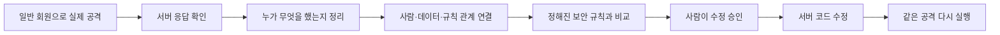

# VibeCheck

## 실제 오픈소스 정적 분석

VibeCheck는 프로젝트 내부에 설치한 오픈소스 Semgrep을 실행하고, 그 결과를 공격 증거와 함께 기록합니다.

```bash
npm run setup:semgrep
```

설치 뒤 Golden Demo를 실행하면 실제 Semgrep 결과가 분석 로그와 결과 보고서에 표시됩니다. Semgrep을 설치하지 못한 경우에는 결과를 꾸며내지 않고 `UNAVAILABLE` 상태로 반환합니다.

> AI로 만든 앱을 배포하기 전에, 실제로 공격해 보고 안전한지 확인하는 도구입니다.

VibeCheck는 보안 점수나 어려운 보고서만 보여주지 않습니다. 일반 사용자 계정으로 실제 요청을 보내 보고, 문제가 발견되면 사람이 승인한 뒤 수정하고, **똑같은 공격을 다시 실행해 막혔는지 확인**합니다.

## 실행

```bash
npm start
```

브라우저에서 [http://localhost:3000](http://localhost:3000)을 열고 **내 앱 공격해보기**를 누르세요. `public/index.html` 파일을 직접 열지 말고, 반드시 위 명령으로 실행하세요.

```bash
npm test
```

## 데모는 이렇게 동작합니다

1. 일반 회원 `member01`이 다른 회원 주소인 `GET /api/users/2`를 요청합니다.
2. 처음에는 서버가 다른 회원 `member02`의 정보를 주고 `200 OK`를 반환합니다.
3. 시스템은 “일반 회원은 다른 사람 정보를 볼 수 없다”는 규칙이 깨졌다고 판단합니다.
4. 사람이 수정안을 승인하면 서버에 본인·관리자만 볼 수 있게 하는 코드를 추가합니다.
5. 같은 요청을 다시 보내 `403 접근 금지`가 나오는지 확인합니다.

즉, **200으로 뚫림 → 사람 승인 → 403으로 차단됨**을 실제 HTTP 요청으로 보여줍니다.

## 내부에서 하는 일

자세한 설명과 그림은 [쉬운 아키텍처 설명](project-context/ARCHITECTURE.md)을 참고하세요.


