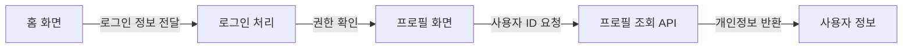
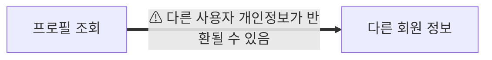
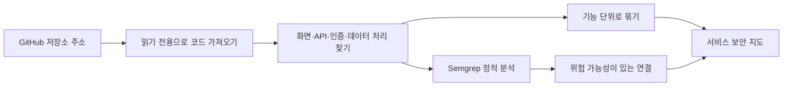
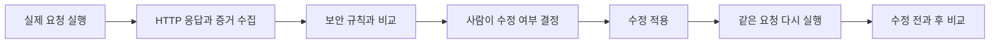
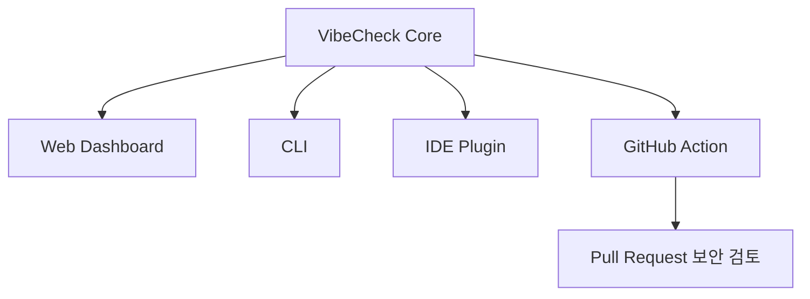

# VibeCheck

> 앱을 배포하기 전에, **내 서비스에서 개인정보가 새지 않는지 직접 확인**하는 도구입니다.

VibeCheck는 어려운 보안 점수만 보여주지 않습니다. GitHub 저장소나 테스트 앱을 분석해 서비스가 어떻게 연결되어 있는지 보여주고, 문제가 의심되는 연결을 사람이 이해할 수 있는 말로 알려줍니다.

예를 들어 “다른 사람의 프로필을 볼 수 있음”, “개인정보가 콘솔에 표시될 수 있음”, “외부 주소로 데이터가 전달될 수 있음”처럼 보여줍니다.

## 결선 제출물과 검증 근거

VibeCheck는 결선 라이브 데모를 위해, 기능 설명뿐 아니라 **실제로 확인할 수 있는 근거**를 함께 제공합니다.

| 결선 제출 항목 | 이 저장소에서 확인할 내용 |
| --- | --- |
| 실제로 동작하는 MVP | 공개 GitHub 저장소 읽기 전용 분석, Semgrep 정적 분석, 서비스 보안 지도, 승인된 로컬 대상의 공격·수정·재검증 흐름 |
| GitHub 저장소 또는 서비스 링크 | 이 저장소와 로컬 실행 주소 `http://localhost:3000` |
| 핵심 사용자 흐름 데모 | [90초 데모 영상 대본](docs/DEMO_VIDEO_SCRIPT.md) |
| Codex Build Log | [사람이 읽는 Build Log](docs/CODEX_BUILD_LOG.md) · [심사용 JSON Build Log](docs/codex-build-log.json) |
| Value & Viability | [대상 사용자·기대 가치·운영 가능성·확장 방향](docs/VALUE_AND_VIABILITY.md) |

### Codex 활용 방식

Codex는 단순히 코드를 작성하는 데만 쓰지 않았습니다. 저장소 분석과 구현 계획을 만들고, 첫 보안 지도의 가독성 문제를 검토해 서비스 기능·데이터 흐름 중심으로 다시 설계했으며, 라우팅·재점검 화면 문제를 복구하고 테스트로 확인했습니다. 작업별 근거와 아직 완료되지 않은 범위는 [Build Log JSON](docs/codex-build-log.json)에 분리해 기록했습니다.

### 현재 MVP의 정직한 범위

- 공개 GitHub 저장소: 실제로 임시 복제하고 Semgrep과 코드 구조 분석을 수행합니다. 원격 저장소에는 수정이나 공격 요청을 보내지 않습니다.
- 승인된 로컬 테스트 대상: 실제 HTTP 요청 증거, 규칙 판정, 사람 승인, 패치, 같은 요청 재실행까지 확인합니다.
- 외부 저장소 수정·재검증: 새 로컬 복제본에만 적용하며, Semgrep 결과가 0건일 때만 PASS로 표시합니다. 자동 수정이 어려운 항목과 격리 실행 환경이 필요한 build/test는 남은 검토 항목으로 정직하게 표시합니다.

## 화면으로 보는 VibeCheck

### 시작과 분석

사용자는 공개 GitHub 저장소 주소를 넣고 분석을 시작합니다. 필요하면 회사의 보안 정책 문서도 함께 넣을 수 있습니다. 정책 문서는 결과를 설명할 때 “우리 서비스에서는 무엇이 허용되고 금지되는가”를 알려주는 근거로 사용됩니다.

분석 중에는 단순한 로딩 화면 대신 다음 네 가지 작업의 진행 상태를 보여줍니다.

1. 프로젝트 구조 확인
2. 권한 관계 정리
3. 회사 정책 문서 검색
4. 공격 또는 점검 경로 준비

오른쪽 로그는 실제 분석 단계가 끝날 때마다 한 줄씩 쌓입니다. 고정된 문구를 반복하는 화면이 아니라, 서버가 전달하는 분석 상태를 보여주도록 구성했습니다.

### 결과: 서비스 보안 지도와 확인된 위험

분석이 끝나면 파일 목록 대신 서비스가 실제로 어떻게 연결되는지 보여줍니다. 화면·인증 처리·API·데이터 처리·외부 연동을 각각의 노드로 만들고, 코드에서 확인된 관계를 선으로 연결합니다.

빨간 선은 “확인이 필요한 보안 흐름”처럼 뭉뚱그려 표시하지 않습니다. Semgrep이 찾은 근거를 바탕으로 `개인정보가 콘솔에 노출될 수 있음`, `외부 주소로 데이터가 전달될 수 있음`, `권한 확인 없이 기능에 접근할 수 있음`처럼 위험 가능성을 직접 설명합니다.

## 무엇을 할 수 있나요?

### 1. GitHub 저장소를 넣어 서비스 지도를 만듭니다

공개 GitHub 저장소 주소를 넣으면 VibeCheck가 코드를 읽고 아래처럼 서비스 기능을 정리합니다.



코드 파일을 전부 늘어놓지 않습니다. `로그인`, `프로필 조회`, `데이터 저장`, `외부 서비스 연동`처럼 **사용자가 이해할 수 있는 기능 단위**로 묶습니다.

각 선은 “어떤 정보가 어디로 이동하는지”를 뜻합니다. 빨간 선은 실제 정적 분석 결과를 바탕으로 추가 확인이 필요한 연결입니다.



빨간 선을 누르면 어떤 코드에서 확인됐는지, 무엇이 문제일 수 있는지, 어떤 데이터를 확인해야 하는지를 볼 수 있습니다.

## 어떻게 분석하나요?



### 1. 코드에서 확인 가능한 사실을 먼저 찾습니다

VibeCheck는 AI가 코드를 대충 요약한 뒤 그래프를 그리지 않습니다. 먼저 코드 안에서 확인할 수 있는 사실을 찾습니다.

- 화면과 컴포넌트
- API 주소와 요청 방식
- 로그인·세션·권한 확인 코드
- 데이터베이스 조회와 저장 코드
- 외부 API 또는 URL 요청
- 파일 사이의 import 관계

그 다음 관련 파일을 기능 하나로 묶습니다. 예를 들어 `Profile.tsx`, `useProfile.ts`, `users.ts`가 연결되어 있다면 사용자에게는 파일 세 개가 아니라 **프로필 조회**라는 하나의 기능으로 보여줍니다.

### 2. 정보가 이동하는 길을 그립니다

각 edge에는 코드에서 확인한 관계를 적습니다.

- 로그인 정보 전달
- 사용자 ID 전달
- API 요청
- 권한 확인
- 데이터 조회·저장
- 외부 API 요청

이렇게 하면 개발자가 아닌 사람도 “어느 기능에서 어떤 정보가 어디로 가는지”를 먼저 이해할 수 있습니다. 파일명·임시 경로·규칙 ID는 edge를 클릭했을 때만 상세 근거로 봅니다.

### 3. 실제 오픈소스 규칙으로 위험 연결을 찾습니다

VibeCheck는 프로젝트 내부에 설치된 [Semgrep](https://semgrep.dev/)을 실제로 실행합니다. Semgrep이 결과를 내지 못하면 결과를 만들어 내지 않고 `UNAVAILABLE`로 표시합니다.

Semgrep 결과의 원래 파일 경로와 줄번호는 개발자에게만 필요한 정보입니다. 기본 결과 화면에서는 다음처럼 자연어로 번역합니다.

| 코드에서 확인된 신호 | 지도에서 보이는 설명 |
| --- | --- |
| `console.log`로 사용자 정보 출력 | 개인정보가 콘솔에 노출될 수 있음 |
| API 키·토큰·비밀번호 관련 값 | 비밀 정보가 코드에 포함될 수 있음 |
| 외부 URL 또는 HTTP 요청 | 외부 주소로 데이터가 전달될 수 있음 |
| 파일 경로·업로드 처리 | 외부 입력으로 파일에 접근할 수 있음 |
| 권한·역할 관련 코드 | 권한 확인 없이 기능에 접근할 수 있음 |

### 4. 승인된 테스트 환경에서는 실제로 다시 확인합니다

분석 결과만으로 “안전하다”고 단정하지 않습니다. 사용자가 소유하거나 테스트 권한을 가진 로컬 환경에서는 다음 검증 흐름을 지원합니다.



이 과정에서 자동 수정이 최종 결정을 대신하지 않습니다. 수정은 사람이 검토·승인한 뒤에만 적용되고, 이후에도 **같은 요청을 다시 실행**해 결과가 실제로 바뀌었는지 확인합니다.

## 화면은 이렇게 읽으면 됩니다

- **서비스 보안 지도**: 내 앱의 기능과 정보 이동 경로
- **일반 선**: 코드에서 확인된 정상 연결
- **빨간 선**: 보안 점검이 필요한 연결
- **확인된 위험**: 기술 용어 대신 어떤 일이 생길 수 있는지 요약
- **재검증 결과**: 수정 전과 후가 어떻게 달라졌는지 비교

VibeCheck는 “취약점 22개”처럼 끝내지 않습니다. 사용자가 먼저 알아야 할 것은 **어디에서 어떤 정보가, 왜 위험할 수 있는지**입니다.

## 실행 방법

먼저 필요한 패키지를 설치합니다.

```bash
npm install
npm run setup:semgrep
```

그 다음 서버를 실행합니다.

```bash
npm start
```

브라우저에서 [http://localhost:3000](http://localhost:3000)을 엽니다.

`public/index.html` 파일을 직접 열면 화면이 제대로 나오지 않을 수 있으니, 반드시 `npm start`로 실행하세요.

작동 확인은 다음 명령으로 할 수 있습니다.

```bash
npm test
```

## 안전하게 사용하는 방법

- 공개 GitHub 저장소 분석은 코드를 **읽기 전용으로 가져와 분석**합니다.
- 외부 서비스에 임의의 공격 요청을 보내지 않습니다.
- 실제 요청 검증과 수정·재검증은 승인된 로컬 테스트 환경 또는 사용자가 연결한 테스트 환경에서만 합니다.
- 회사 보안 정책 문서를 올리면, 결과를 설명할 때 해당 문서의 관련 내용을 함께 보여줍니다.

## 현재 구현된 범위

현재 실제로 동작하는 기능:

- 공개 GitHub 저장소 연결 및 코드 구조 분석
- 기능별 서비스 보안 지도 생성
- [Semgrep](https://semgrep.dev/) 기반 실제 정적 분석
- 위험한 정보·권한 흐름을 빨간 edge로 표시
- 승인된 로컬 테스트 환경에서의 실제 HTTP 검증 흐름
- 회사 보안 정책 문서 업로드 및 문단 검색

아직 확장 단계인 기능:

- 외부 저장소 코드의 자동 수정·PR 생성
- 외부 웹사이트에 대한 실제 공격
- 실제 Jira·Confluence 계정 연동
- 의미 기반 임베딩 RAG

## 앞으로의 확장 방향

분석 엔진은 웹 화면에만 묶이지 않도록 설계하고 있습니다. 다음 단계는 같은 분석 결과를 CLI, IDE, PR 검토에서도 재사용하는 것입니다.



우선순위는 `CLI → IDE Plugin → GitHub Action`입니다. 현재 공개 저장소 분석과 서비스 보안 지도 생성은 웹에서 실제로 동작하며, 이후에도 동일한 분석 코어를 사용하도록 확장할 계획입니다.

## 개발자를 위한 참고

자세한 내부 구조는 [아키텍처 설명](project-context/ARCHITECTURE.md)을 참고하세요.
