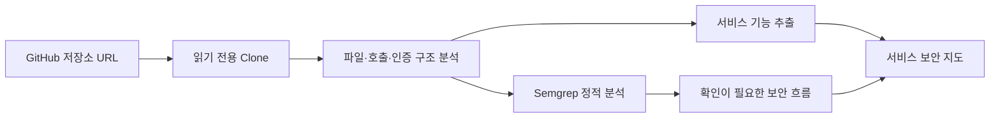

# VibeCheck

## 실제 오픈소스 정적 분석

VibeCheck는 프로젝트 내부에 설치한 오픈소스 Semgrep을 실행하고, 그 결과를 공격 증거와 함께 기록합니다.

```bash
npm run setup:semgrep
```

설치 뒤 Golden Demo를 실행하면 실제 Semgrep 결과가 분석 로그와 결과 보고서에 표시됩니다. Semgrep을 설치하지 못한 경우에는 결과를 꾸며내지 않고 `UNAVAILABLE` 상태로 반환합니다.

> AI로 만든 앱을 배포하기 전에, 실제로 공격해 보고 안전한지 확인하는 도구입니다.

VibeCheck는 보안 점수나 어려운 보고서만 보여주지 않습니다. 일반 사용자 계정으로 실제 요청을 보내 보고, 문제가 발견되면 사람이 승인한 뒤 수정하고, **똑같은 공격을 다시 실행해 막혔는지 확인**합니다.

## 실행

```bash
npm start
```

브라우저에서 [http://localhost:3000](http://localhost:3000)을 열고 **내 앱 공격해보기**를 누르세요. `public/index.html` 파일을 직접 열지 말고, 반드시 위 명령으로 실행하세요.

```bash
npm test
```

## 데모는 이렇게 동작합니다

1. 일반 회원 `member01`이 다른 회원 주소인 `GET /api/users/2`를 요청합니다.
2. 처음에는 서버가 다른 회원 `member02`의 정보를 주고 `200 OK`를 반환합니다.
3. 시스템은 “일반 회원은 다른 사람 정보를 볼 수 없다”는 규칙이 깨졌다고 판단합니다.
4. 사람이 수정안을 승인하면 서버에 본인·관리자만 볼 수 있게 하는 코드를 추가합니다.
5. 같은 요청을 다시 보내 `403 접근 금지`가 나오는지 확인합니다.

즉, **200으로 뚫림 → 사람 승인 → 403으로 차단됨**을 실제 HTTP 요청으로 보여줍니다.

## 내부에서 하는 일

자세한 설명과 그림은 [쉬운 아키텍처 설명](project-context/ARCHITECTURE.md)을 참고하세요.


## GitHub 저장소 실제 분석

홈 화면에 공개 GitHub 저장소 URL을 입력하면 VibeCheck가 해당 저장소를 **읽기 전용으로 실제 clone**한 뒤 다음을 수행합니다.

1. 파일 구조를 읽고 프로젝트 유형을 추정합니다.
2. 화면·로그인·프로필·사용자 데이터·관리자·업로드·외부 요청처럼 코드 근거가 있는 서비스 기능을 찾습니다.
3. Semgrep 정적 분석을 실제 실행합니다.
4. 분석용 파일 데이터와 별도로, 사용자가 읽기 쉬운 **서비스 보안 지도**를 만듭니다.



서비스 보안 지도에서는 파일명이나 API 개수를 큰 노드로 보여주지 않습니다. 대신 `홈 화면`, `로그인`, `프로필 조회`, `사용자 개인정보`, `외부 서비스 요청`처럼 코드에서 근거를 찾은 기능을 노드로 표현합니다. 기능 사이의 정보·권한 이동은 edge로 표시하며, 실제 Semgrep 결과·HTTP 증거·규칙 위반과 연결된 edge만 강조합니다.

### 분석 근거와 상태

| 상태 | 의미 |
| --- | --- |
| `SAFE` | 코드 구조에서 정상 연결로 확인된 흐름 |
| `WARNING` | Semgrep 결과 등 추가 확인이 필요한 흐름 |
| `CRITICAL` | 실제 HTTP 증거 또는 결정적 규칙 위반으로 확인된 흐름 |
| `UNKNOWN` | 근거가 부족해 판단할 수 없는 흐름 |

GitHub 저장소 분석은 코드를 읽고 Semgrep을 실행하는 기능입니다. **원격 웹 서비스에 공격 요청을 보내지 않습니다.** 실제 공격·수정·동일 공격 재검증은 승인된 로컬 Golden Demo 또는 사용자가 명시적으로 연결한 테스트 환경에서만 수행합니다.

## 구현 상태

- 실제 구현: 로컬 Golden Demo HTTP 공격, Security Facts, 내부 KG, BAC-001 결정 규칙, 사람 승인, 실제 패치, 동일 공격 재검증, Semgrep, 정책 문서 업로드·문단 검색, 공개 GitHub 저장소 clone·구조 분석
- 데모 전용: Jira/Confluence 기록 표현
- 아직 구현하지 않음: 임의 원격 웹 URL 공격, 실제 Jira/Confluence 계정 연동, 임베딩 기반 RAG, 외부 저장소에 대한 자동 코드 수정
