# VibeCheck

**Policy-Grounded Security Validation**

> 바이브 코딩은 누구나 서비스를 만들 수 있게 했습니다.  
> 하지만 누구나 안전한 서비스를 만들 수 있게 하지는 못했습니다.

VibeCheck는 AI로 만든 앱을 배포하기 전에, **회사·프로젝트 정책을 기준으로 실제 요청을 보내고, 증거를 모아, 사람이 승인한 뒤에만 고치고, 같은 공격을 다시 실행해 막혔는지 확인**하는 보안 검증 도구입니다.

LLM에게 “안전한가요?”라고 다시 묻지 않습니다.  
AI는 코드와 공격 결과의 의미를 이해하고, Symbolic Engine은 사람이 승인한 규칙으로 위반 여부를 결정적으로 판정합니다.

| | |
| --- | --- |
| 라이브 데모 | [https://view-check-three.vercel.app](https://view-check-three.vercel.app/) |
| 시연 영상 | [https://youtu.be/eyd36YSsI-U](https://youtu.be/eyd36YSsI-U) |
| 발표 자료 PDF | [VibeCheck.pdf](https://github.com/dlwldn4824/vibe_check/blob/main/docs/slides/VibeCheck.pdf) |
| 채점 근거 발췌 PDF | [VibeCheck-evaluation-extract.pdf](https://github.com/dlwldn4824/vibe_check/blob/main/docs/slides/VibeCheck-evaluation-extract.pdf) |
| 로컬 실행 | [http://localhost:3000](http://localhost:3000) |
| 팀 | 박지원 · 유성호 · 이보민 · 이지우 |

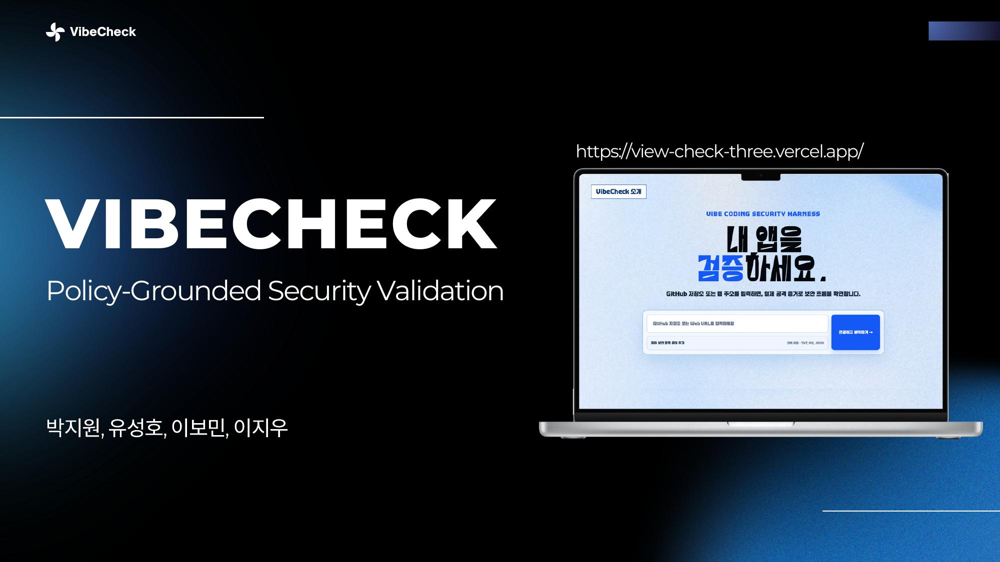

---

## 한 줄 정의

**VibeCheck는 정책 설정 → 실제 HTTP 검증 → 설명 가능한 증거 → 사람 승인 → Codex 수정 → 동일 공격 Replay를 하나의 루프로 연결하는 Policy-Grounded Security Harness입니다.**

기존 도구가 각각 따로 하던 일을 이렇게 이어 줍니다.

```text
정적 신호  →  실제 HTTP 증거  →  규칙 판정  →  사람 승인  →  동일 공격 재검증
```

---

## 왜 필요한가

### 바이브 코딩이 바꾼 것

개발 경험이 부족한 사용자도 프롬프트만으로 실제 서비스를 만들고 배포할 수 있게 되었습니다. 배포되는 앱의 수는 빠르게 늘고 있습니다.

문제는 **생성 속도가 검증 속도를 앞지른다**는 점입니다.

> 누구나 하루 만에 서비스를 배포하는 시대.  
> 그런데 그 코드가 안전한지는 잘 확인하고 있을까요?


### 실제로 반복되는 보안 문제

RedAccess가 Lovable, Replit, Base44, Netlify 관련 공개 자산 약 **38만 개**를 조사한 결과입니다.

| 공개 자산 | 기업 용도 자산 | 민감 데이터 노출 |
| --- | --- | --- |
| 약 38만 개 | 5,000개 이상 | 2,000개 이상 (기업 자산의 약 40%) |

빠르게 배포된 웹앱에서는 인증 누락, 과도한 권한, 민감정보 노출 같은 **기본적인 보안 문제**가 반복됩니다.

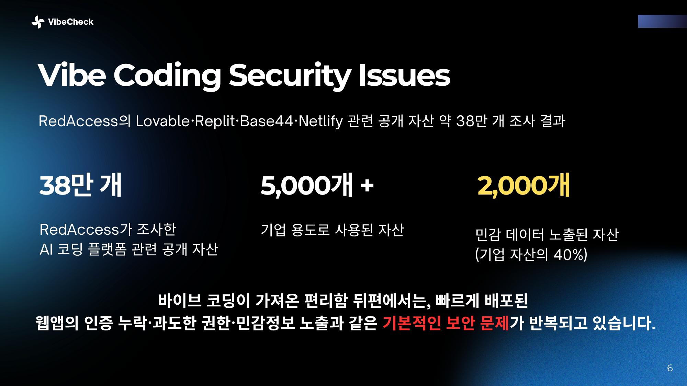

### 보안에서 메워야 하는 3가지 격차

| 격차 | 질문 | 의미 |
| --- | --- | --- |
| **Context Gap** | 누가 이 데이터에 접근할 수 있나? | 코드는 돌아가지만, 권한·데이터 소유 관계가 보이지 않음 |
| **Comprehension Gap** | 왜 이 코드가 위험한가? | CWE 번호와 파일 경로만으로는 내 서비스에서 무슨 일이 일어나는지 이해하기 어려움 |
| **Validation Gap** | 같은 공격도 막히는가? | AI가 “고쳤다”고 말해도, 동일 요청이 실제로 차단됐는지 증명되지 않음 |

생성 속도가 검증 속도보다 빠르면, 이해되지 않고 검증되지 않은 코드 위험이 누적됩니다.

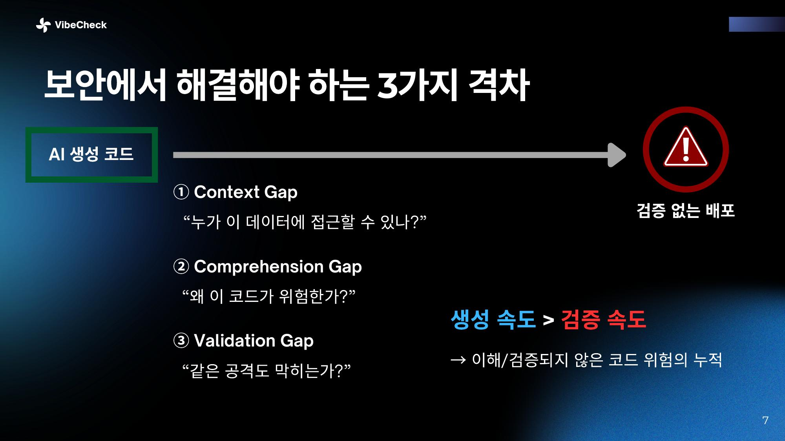

### 개발자도 검증을 건너뛰고 있다

Sonar가 전 세계 전문 개발자 1,100명 이상을 조사한 결과입니다.

| 지표 | 수치 |
| --- | --- |
| 커밋되는 코드 중 AI 생성/보조 비율 | **42%** |
| AI 코드가 완전히 정확하다고 신뢰하지 않는 개발자 | **96%** |
| 커밋 전 항상 검증하는 개발자 | **48%** |

개발자는 AI 코드를 신뢰하지 않는다고 말하면서도, 절반 이상은 검증 절차를 생략합니다. 바이브코더 162명 조사에서도 “AI에게 자신의 실수를 찾거나 고치도록 요청한다”는 응답이 높게 나타났습니다.

즉 **검증 과정조차 AI에게 맡기는 공백**이 생깁니다. AI가 만든 코드는 요구사항을 놓칠 수 있고, 그 이유조차 개발자가 이해하기 어렵기 때문에 **사람이 판단할 수 있는 검증 과정**이 필요합니다.

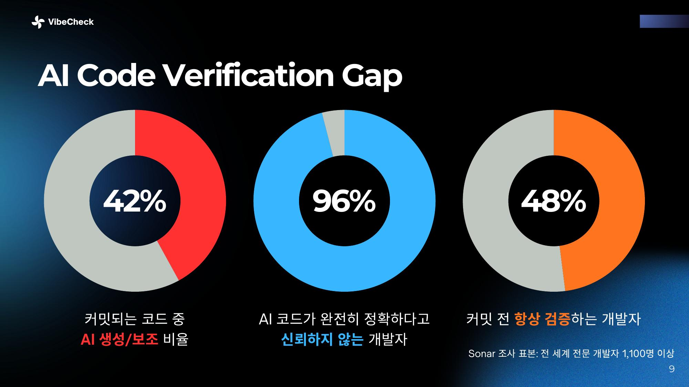

---

## 기존 도구의 한계

| 구분 | 강점 | 남아 있는 공백 |
| --- | --- | --- |
| **SAST** (정적 코드 분석) | 소스코드의 위험 패턴 탐지 | 실제 공격 가능성, 비즈니스 맥락 판단 부족 |
| **DAST** (동적 보안 테스트) | 실행 중인 웹·API 행위 검증 | 실행 증거를 내부 정책·수정·재검증까지 연결하기 어려움 |
| **AI Code Review** | 코드 설명·수정안 생성 | 수정안이 동일 공격을 실제로 막았는지 증명하기 어려움 |
| **기업 보안 정책 문서** | 조직의 보안 기준 제공 | 개발·테스트·수정 결과와 자동으로 연결되지 않음 |

VibeCheck는 이 네 가지를 대체하지 않습니다.  
**정적 신호 → 실제 HTTP 증거 → 규칙 판정 → 사람 승인 → 동일 공격 재검증**을 하나의 흐름으로 연결합니다.

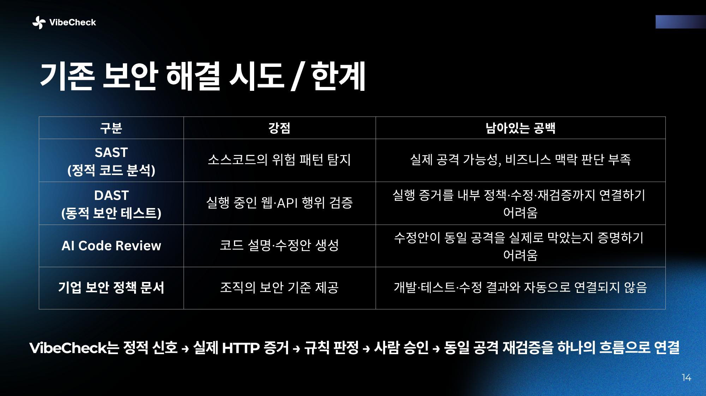

---

## 누구를 위한 제품인가

대상은 **바이브 코딩으로 앱을 만든 개발자**입니다.

| | Pain Point |
| --- | --- |
| 01 | 코드는 돌아가는데 안전한지는 모른다. 기능은 확인할 수 있지만 인증·권한·개인정보 흐름 문제는 발견하기 어렵다. |
| 02 | 수천 줄의 AI 코드를 매번 검토할 수 없다. AI 생성 속도를 사람 코드 리뷰가 따라가지 못한다. |
| 03 | 다시 AI에게 물어봐도 확신할 수 없다. “보안 문제 없어?”라는 답은 나오지만, 실제로 공격이 차단되는지는 알 수 없다. |
| 04 | 보안 도구의 결과도 어렵다. `CWE-639`, Broken Access Control, 파일 경로와 경고 목록만으로는 내 서비스에서 무슨 일이 일어나는지 이해하기 어렵다. |

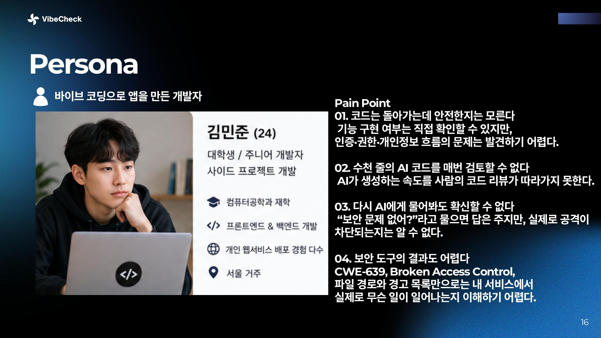

---

## VibeCheck가 하는 일

정책을 세우고, 실제 요청으로 확인하고, 사람이 승인한 뒤, 같은 요청을 다시 검증합니다.

```text
1 정책 설정          기업 정책 · 프로젝트 규칙
2 검증 시나리오      안전한 테스트 계획
3 실제 요청          REAL HTTP CHECK
4 증거 / 관계도      EXPLAINABLE EVIDENCE
5 규칙 판정          정책 위반인가?
6 사람 승인          HUMAN APPROVAL
7 수정안 적용        승인된 CODEX PATCH
8 같은 요청 Replay   REPLAY VERIFICATION
```

수정 전후는 이렇게 증명합니다.

```text
Before     MEMBER → GET /api/users/2     200 · 다른 사람 정보 노출
After      MEMBER → GET /api/users/2     403 · PASS
```

한 번 막은 공격은 회귀 테스트로 남겨 다음 배포에도 확인합니다.

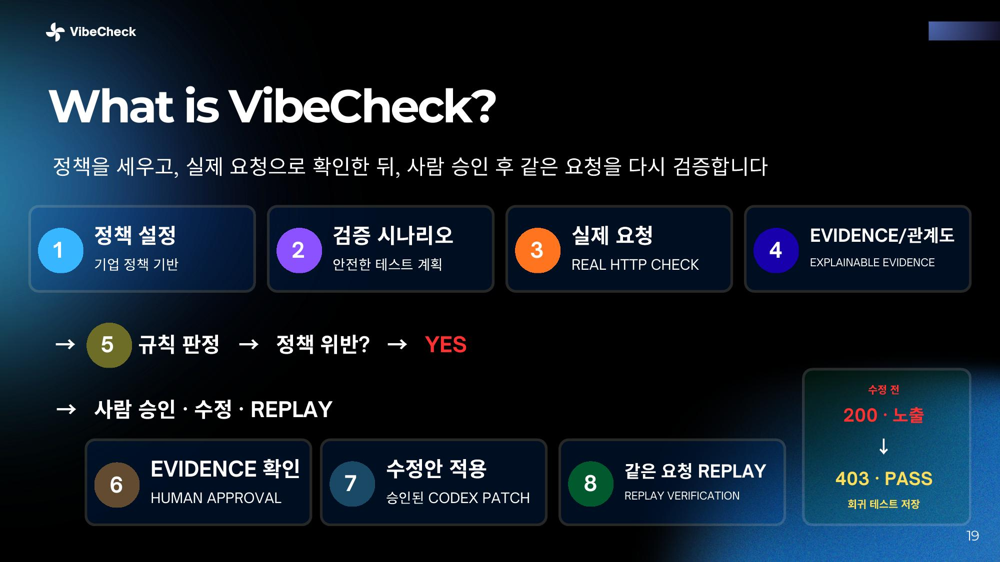

---

## 사용자 여정

배포 직전, 개발자는 위험을 이해하고 → 수정을 승인하고 → 같은 공격을 다시 확인하기를 기대합니다.

| 단계 | 사용자가 하는 일 | 감정 |
| --- | --- | --- |
| 시작 | 저장소 또는 테스트 앱을 연결하고 점검 범위를 고른다 | 불안 |
| 정책 설정 | 회사 정책 문서를 넣고, “일반 회원은 본인 정보만 조회” 같은 규칙을 확인한다 | 궁금 |
| 위험 이해 | 서비스 지도에서 데이터 흐름과 위험 연결 이유를 본다 | 이해 |
| 실제 검증 | 멤버1이 멤버2 정보를 요청한다. 서버가 `200 OK`로 다른 사람 정보를 돌려준다 | 경각심 |
| 수정 및 재검증 | 수정안을 검토·승인한 뒤 같은 요청을 다시 실행한다. `403 PASS`로 차단을 확인한다 | 확신 |

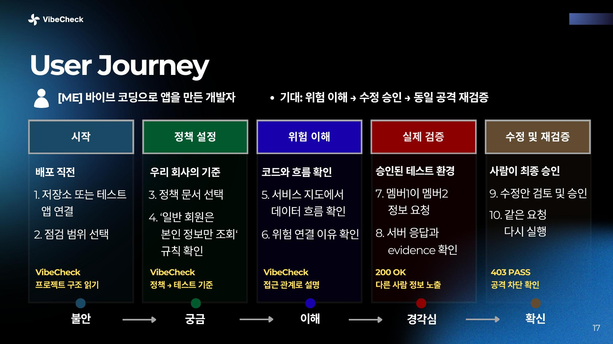

---

## 어떻게 동작하는가

### 1. 정적 분석으로 위험 패턴을 찾는다

[Semgrep](https://semgrep.dev/)으로 소스코드의 보안 취약 패턴과 위험 코드를 탐지합니다. Semgrep이 결과를 내지 못하면 결과를 만들어 내지 않고 `UNAVAILABLE`로 표시합니다.

기본 화면에는 파일 경로와 규칙 ID를 나열하지 않습니다. 지도에서는 이렇게 번역합니다.

| 코드에서 확인된 신호 | 지도에서 보이는 설명 |
| --- | --- |
| `console.log`로 사용자 정보 출력 | 개인정보가 콘솔에 노출될 수 있음 |
| API 키·토큰·비밀번호 관련 값 | 비밀 정보가 코드에 포함될 수 있음 |
| 외부 URL 또는 HTTP 요청 | 외부 주소로 데이터가 전달될 수 있음 |
| 파일 경로·업로드 처리 | 외부 입력으로 파일에 접근할 수 있음 |
| 권한·역할 관련 코드 | 권한 확인 없이 기능에 접근할 수 있음 |

### 2. AI는 상황을 사실(Fact)로 바꾼다

원시 HTTP 로그만으로는 규칙 엔진이 `/api/users/12`가 무슨 의미인지 알 수 없습니다. Neural 층이 코드·로그·응답·정책 근거를 읽어 계산 가능한 사실로 변환합니다.

```json
{
  "actor": "MEMBER",
  "actor_id": "member01",
  "action": "READ",
  "resource": "USER_PROFILE",
  "resource_owner": "user02",
  "relationship": "OTHER_USER",
  "observed": "ALLOW"
}
```

자체 모델은 자연어에서 사용자 역할과 행동을 추출하고, 같으면 본인 · 다르면 타인으로 소유 관계를 판별합니다. 대조 검증에서 NLI가 사용자 ID 관계를 일부 오인하는 사례를 발견해 **HYBRID 설계**를 반영했습니다. 학습·추론에는 RunPod GPU를 사용했습니다.

### 3. RAG는 판정 기준을 가져온다

RAG는 최종 판정을 내리지 않습니다. **어떤 규칙을 적용해야 하는지**만 찾습니다.

- 전역 지식: OWASP, CWE, API 인가 가이드
- 프로젝트 지식: 보안 정책, API 명세, 과거 요구사항·프롬프트

예:

```text
Project Policy
Members may access only their own profiles.

OWASP
Authorization must be enforced server-side.
```

### 4. Knowledge Graph로 위험 흐름을 보여준다

추출한 사실을 관계로 구조화합니다.

- 홈 → 로그인 → 프로필: 정상적인 서비스 기능 흐름 (검정)
- 프로필 → 다른 사용자 정보: 확인이 필요한 데이터 접근 관계 (빨강)

파일 목록 대신 **홈 · 로그인 · 프로필 · 외부 연동** 같은 기능 단위로 묶고, edge에는 로그인 정보 전달, 개인정보 반환, 외부 주소 요청처럼 정보가 어디로 가는지를 적습니다.

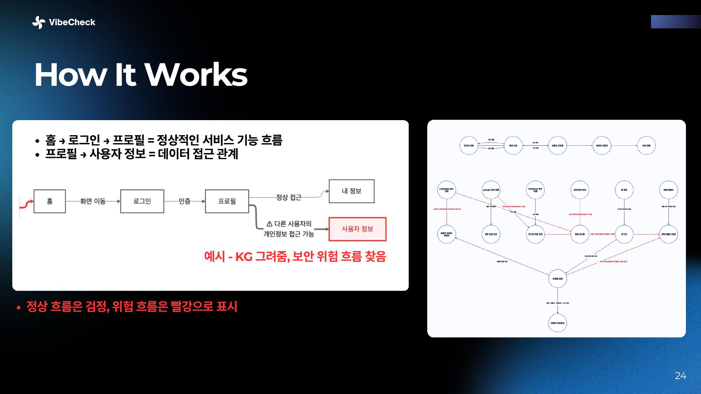

### 5. Symbolic Engine이 규칙과 관측을 비교한다

사람이 승인한 규칙과 관측 사실을 코드로 비교합니다. AI가 임의로 안전하다고 말하지 않습니다.

```text
IF actor.role == MEMBER
AND resource == USER_PROFILE
AND relationship == OTHER_USER
THEN expected = DENY

Expected  DENY
Observed  ALLOW
→ VIOLATION
```

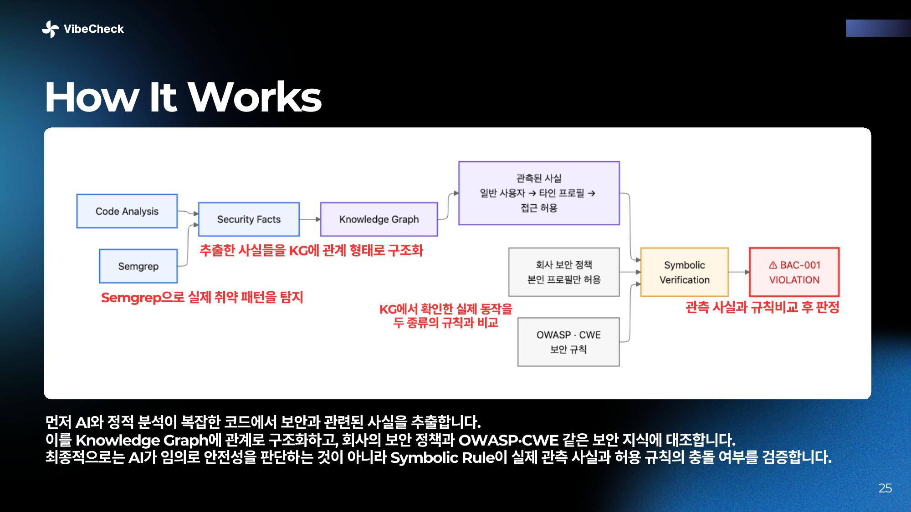

### 6. 사람이 승인하고, 같은 공격을 다시 실행한다

Codex가 수정했다고 말하는 것도 믿지 않습니다. 사람이 수정안을 승인한 뒤에만 패치를 적용하고, **처음 성공했던 동일 공격을 다시 실행**해 실제로 차단됐는지 확인합니다.

```text
Attack → Evidence → Rule Verdict → Human Approve → Codex Repair → Replay
```

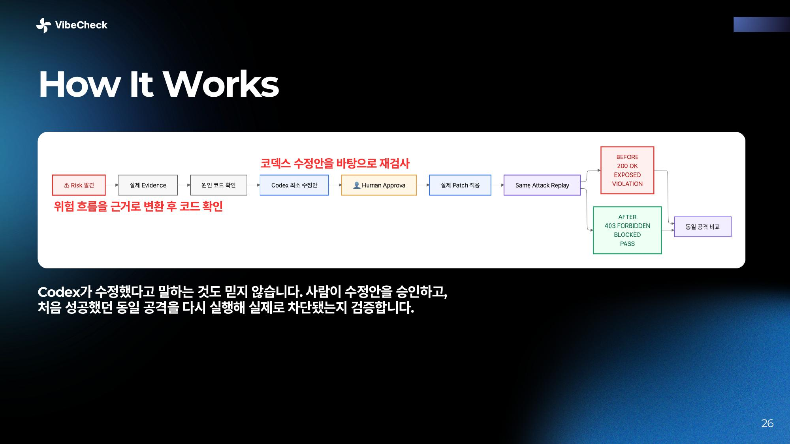

---

## 화면으로 보는 흐름

### 시작과 분석

공개 GitHub 저장소 주소를 넣고 분석을 시작합니다. 회사 보안 정책 문서가 있으면 함께 넣을 수 있습니다. 정책 문서는 “우리 서비스에서 무엇이 허용되고 금지되는가”를 설명하는 근거로 쓰입니다.

분석 중에는 다음 진행 상태를 보여줍니다.

1. 프로젝트 구조 확인
2. 권한 관계 정리
3. 회사 정책 문서 검색
4. 공격 또는 점검 경로 준비

오른쪽 로그는 서버가 전달하는 실제 분석 단계가 끝날 때마다 쌓입니다.

### 결과: 서비스 보안 지도

분석이 끝나면 파일 목록 대신 서비스가 어떻게 연결되는지를 보여줍니다.

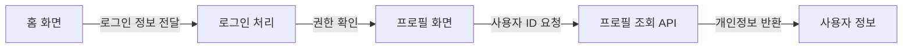

빨간 선은 뭉뚱그린 “확인 필요”가 아닙니다. Semgrep 근거를 바탕으로 `다른 사용자 개인정보가 반환될 수 있음`처럼 직접 설명합니다. 선을 누르면 코드 근거, 왜 위험한지, 어떤 데이터를 확인해야 하는지를 볼 수 있습니다.

### 화면을 읽는 방법

- **서비스 보안 지도**: 기능과 정보 이동 경로
- **일반 선**: 코드에서 확인된 정상 연결
- **빨간 선**: 보안 점검이 필요한 연결
- **확인된 위험**: 기술 용어 대신 어떤 일이 생길 수 있는지 요약
- **재검증 결과**: 수정 전과 후가 어떻게 달라졌는지 비교

---

## 기대 효과

보안을 ‘개발 완료 뒤의 검사’가 아니라 **배포 전, 증명 가능한 품질 게이트**로 바꿉니다.

| 대상 | 달라지는 점 |
| --- | --- |
| 개발자 | 취약점 번호가 아니라, 누가 어떤 데이터에 왜 접근 가능한지를 보고 수정 이유를 이해한다 |
| 보안팀 | 정책 문서가 배포 전 검증 시나리오와 판정 기준이 된다 |
| 서비스 오너 | `200 노출 → 403 PASS`처럼 수정 전후 실제 결과로 승인한다 |
| 조직 | 한 번 막은 공격을 회귀 테스트로 넘겨 다음 배포에도 확인한다 |

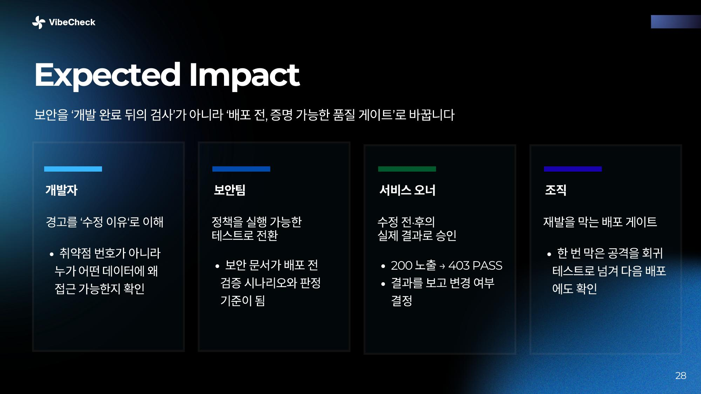

---

## 실행 방법

```bash
npm install
npm run setup:semgrep
npm start
```

브라우저에서 [http://localhost:3000](http://localhost:3000)을 엽니다.  
`public/index.html`을 직접 열면 화면이 제대로 나오지 않을 수 있으니 반드시 `npm start`로 실행하세요.

```bash
npm test
```

`npm test`는 Golden Demo의 `HTTP 200 → 위반 → 승인 → 패치 → HTTP 403 → PASS` 흐름을 검증합니다.

### Codex API로 수정안 만들기

재점검에서 실제 Codex 수정안을 만들려면 프로젝트 루트에 `.env`를 만들고 `OPENAI_API_KEY`를 설정합니다. 키는 Git에 넣지 않습니다. Codex API는 수정 대상 파일 하나와 Semgrep 근거만 받아 최소 unified diff를 만들고, VibeCheck는 그 diff가 **새 로컬 복제본의 한 파일만** 바꾸는지 `git apply --check`로 확인한 뒤에만 적용합니다.

```bash
cp .env.example .env
# .env에 OPENAI_API_KEY 입력
npm start
```

기본값은 서로 다른 파일 3개까지입니다. `VIBECHECK_REPAIR_MAX_ITEMS=1~10`으로 조정할 수 있습니다.

---

## 안전하게 사용하는 방법

- 공개 GitHub 저장소 분석은 코드를 **읽기 전용으로 가져와 분석**합니다.
- 원격 저장소에는 수정하거나 push하지 않습니다.
- 외부 서비스에 임의의 공격 요청을 보내지 않습니다.
- 실제 요청 검증과 수정·재검증은 승인된 로컬 테스트 환경에서만 합니다.
- 회사 보안 정책 문서를 올리면, 결과를 설명할 때 해당 문서의 관련 문단을 함께 보여줍니다.

---

## 현재 구현 범위

실제로 동작하는 기능:

- 공개 GitHub 저장소 연결 및 코드 구조 분석
- 기능별 서비스 보안 지도 생성
- Semgrep 기반 실제 정적 분석
- 위험한 정보·권한 흐름을 빨간 edge로 표시
- 승인된 로컬 테스트 환경에서의 실제 HTTP 검증 흐름
- 회사 보안 정책 문서 업로드 및 문단 검색
- 사람 승인 후 패치, 동일 요청 Replay
- `OPENAI_API_KEY`가 있을 때 Codex API로 한 파일 단위 수정안 생성

아직 확장 단계인 기능:

- 외부 저장소 코드의 자동 수정·PR 생성
- 외부 웹사이트에 대한 실제 공격
- 실제 Jira·Confluence 계정 연동
- 의미 기반 임베딩 RAG
- 격리 실행 환경이 필요한 외부 저장소 build/test

---

## 확장 방향

현재 웹 MVP의 분석·검증 코어를 그대로 활용해, 코드를 쓰는 순간부터 배포 이후까지 확장합니다.

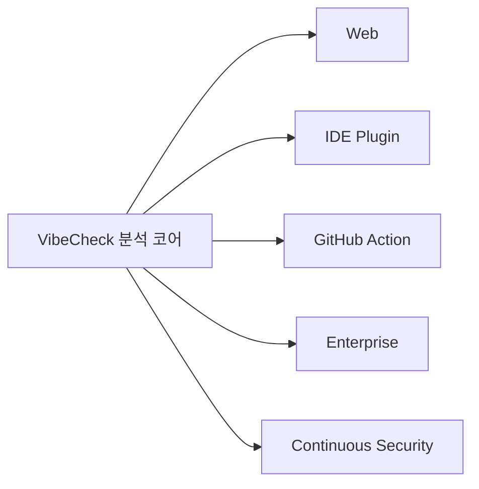

| 단계 | 방향 |
| --- | --- |
| **NOW — Web** | GitHub 저장소 연결 → 보안 지도 → 위험 탐지 → 수정·재검증 |
| **01 IDE Plugin** | 바이브 코딩을 하는 순간 위험한 코드와 데이터 흐름을 바로 확인 |
| **02 GitHub Action** | PR마다 자동 실행해 배포 전 위험 변경 차단 |
| **03 Enterprise** | 기업별 보안 정책·내부 문서를 연결해 조직 기준에 맞는 검증 |
| **04 Continuous Security** | Jira·Confluence·CI/CD와 연결해 발견 → 담당자 → 수정 → 재검증까지 추적 |

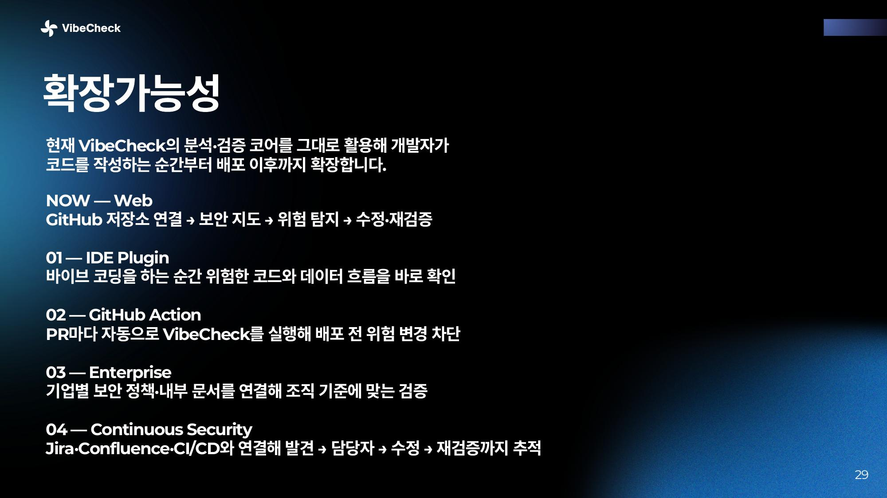

---

## Codex Build Orchestration

Codex는 한 번 코드를 생성하는 도구가 아니라, 계획부터 배포까지 사용한 실행 엔진입니다.

| 단계 | Codex 활용 | 실제 수행 | 결과 |
| --- | --- | --- | --- |
| **01 PLAN** | 요구사항 분석 및 구현 계획 | Repository 분석 → Security Map → 위험 탐지 → Human Approval → Replay 구조 설계 | 구현 범위·우선순위 수립 |
| **02 BUILD** | 기능 단위 구현 위임 | GitHub Clone, 코드 구조 분석, Semgrep 연결, Security Map, Golden Demo, 정책 문서 검색 | 실제 동작 MVP |
| **03 INTEGRATE** | 기존 기능 연결 | 분석 결과를 Security Facts/KG와 연결하고 위험한 정보·권한 흐름을 Edge로 표현 | 개별 기능을 하나의 제품 흐름으로 통합 |
| **04 REVIEW** | 구현 결과 자체 검토 | 테스트·브라우저 렌더링·코드 구조 확인, 초기 KG의 낮은 가독성 발견 | 문제점과 개선 대상 식별 |
| **05 RECOVER** | 실패 원인 추적 및 반복 수정 | UI/CSS 문제, 의미 없는 Repository→API→Auth 그래프를 기능 중심 Security Map으로 재설계 | 실패를 다음 구현 컨텍스트로 활용 |
| **06 VERIFY** | 코드가 아닌 실제 동작 검증 | `npm test`, 실제 HTTP 공격, 패치 후 동일 공격 Replay | HTTP 200 → 403, 회귀 테스트 PASS |
| **07 DOCUMENT** | 구현 과정과 한계 기록 | README, Architecture, 구현 범위, 제한사항, Build Log 정리 | 재현 가능한 개발 기록 |
| **08 SHIP** | Git/GitHub 작업 마무리 | 변경사항 점검 → Commit → Push | 실제 저장소에 결과물 반영 |

작업별 근거와 아직 완료되지 않은 범위는 [Build Log](docs/CODEX_BUILD_LOG.md)와 [심사용 JSON](docs/codex-build-log.json)에 분리해 기록했습니다.

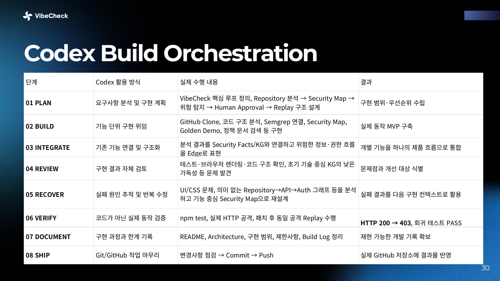

---

## 팀

| 역할 | 이름 | 담당 |
| --- | --- | --- |
| **Build** | 이지우 | 프론트엔드 · 전체 서비스 설계. 아키텍처와 사용자 흐름, 보안 지도·대시보드 UI/UX, Human-in-the-loop 검증 흐름, 기능 통합 |
| **AI 모델** | 유성호 | DistilBERT/NLI 모델 학습, Security Facts 추출, Neural-Symbolic 구조 설계, 규칙 기반 보안 검증 및 재검증 파이프라인 |
| **Insight · UX** | 박지원 | 사용자 여정·서비스 플로우, 보안 결과 시각화 및 대시보드 UX/UI 기획, 발표자료 디자인, 데모 시나리오·영상, 서비스 메시지 |
| **Insight · 전략** | 이보민 | 바이브코딩 보안 문제 정의, SAST·DAST·AI 코드리뷰 경쟁 분석, 타깃·Value Proposition, 차별화·사업성, 피치 스토리라인 |


---

## 제출 자료

| 항목 | 위치 |
| --- | --- |
| 발표 자료 PDF | [docs/slides/VibeCheck.pdf](https://github.com/dlwldn4824/vibe_check/blob/main/docs/slides/VibeCheck.pdf) |
| 채점 근거 발췌 PDF | [docs/slides/VibeCheck-evaluation-extract.pdf](https://github.com/dlwldn4824/vibe_check/blob/main/docs/slides/VibeCheck-evaluation-extract.pdf) |
| 결선 제출 요약 | [docs/submission/FINAL_SUBMISSION.md](docs/submission/FINAL_SUBMISSION.md) |
| Value & Viability | [docs/VALUE_AND_VIABILITY.md](docs/VALUE_AND_VIABILITY.md) |
| Codex Build Log | [docs/CODEX_BUILD_LOG.md](docs/CODEX_BUILD_LOG.md) · [JSON](docs/codex-build-log.json) |
| 아키텍처 | [project-context/ARCHITECTURE.md](project-context/ARCHITECTURE.md) |

---

VibeCheck는 경고 목록으로 끝내지 않습니다.

> We don't trust AI to say it's secure.  
> We make it prove it.
