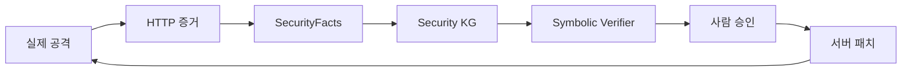

# VibeCheck

> 바이브 코딩은 만드는 일을 쉽게 만들었습니다. VibeCheck는 검증하는 일을 쉽게 만듭니다.

AI가 안전하다고 말하는 것을 믿지 않습니다. **실제 공격을 재실행해 증명합니다.**

## 실행

```bash
npm start
```

브라우저에서 [http://localhost:3000](http://localhost:3000)을 열고 **내 앱 공격하기**를 누르세요.

```bash
npm test
```

## Golden Demo

1. `member01`이 실제로 `GET /api/users/2`를 요청합니다.
2. 취약한 초기 서버가 `200`과 `member02` 데이터를 반환합니다.
3. SecurityFacts, KG, 결정적 `BAC-001` 규칙 검증이 **위반**을 판정합니다.
4. 사람이 수정안을 승인하면 서버 파일에 최소 소유권 검사 패치가 적용됩니다.
5. 같은 HTTP 요청을 다시 실행해 `403`과 **통과**를 증명합니다.

## 아키텍처

상세한 Mermaid 다이어그램과 NeSy/KG 책임 경계는 [project-context/ARCHITECTURE.md](project-context/ARCHITECTURE.md)를 참고하세요.


