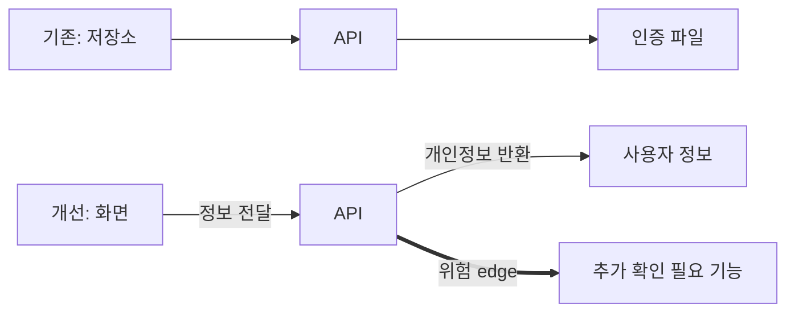

# Codex Build Log

VibeCheck는 Codex를 단순 코드 생성기가 아니라 **계획 → 구현 → 검토 → 복구 → 검증** 과정에 사용했습니다.

## 01. Plan — 무엇을 만들지 정의

초기 목표는 URL을 입력해 취약점을 나열하는 스캐너가 아니었습니다. 저장소를 분석해 서비스의 데이터·권한 흐름을 보여주고, 사람이 위험을 이해할 수 있도록 하는 Security Harness를 목표로 정했습니다.


## 02. Build — 실제 분석 기능 구현

| 작업 | 실제 구현 근거 |
| --- | --- |
| Semgrep 연결 | `7b0842a` · 실제 오픈소스 정적 분석 연동 |
| 회사 정책 근거 | `5efe822` · 정책 문서 업로드와 문단 검색 |
| GitHub 분석 | `b1f74b5` · 공개 저장소 clone과 구조 분석 |
| 기능별 보안 지도 | `0a526e9` · Cytoscape.js와 세분화된 노드/edge |
| 문서화 | `3617651` · 제품 화면과 비개발자 설명 |

## 03. Review — 첫 결과를 그대로 쓰지 않음

초기 그래프는 `Repository → API → Auth`처럼 코드 분석 순서를 보여주는 형태였습니다. UX 검토에서 사용자는 분석 파이프라인이 아니라 **내 서비스에서 무엇이 어디로 연결되는지**를 알고 싶다는 문제가 발견됐습니다.

그래서 다음처럼 구조를 바꿨습니다.



이 과정에서 노드는 파일 개수나 규칙 수가 아니라 서비스 기능으로, edge는 데이터·권한 이동으로 재정의했습니다.

## 04. Recover — 이해하기 어려운 결과를 고침

정적 분석 결과가 `/var/.../file.yml:20`처럼 임시 경로와 줄번호만 표시되는 문제가 있었습니다. 이 정보는 개발자가 아닌 사용자에게 의미가 없었습니다.

그래서 결과를 다음과 같이 번역하도록 복구했습니다.

- `console.log`와 사용자 정보 → 개인정보가 콘솔에 노출될 수 있음
- API 키·토큰·비밀번호 신호 → 비밀 정보가 코드에 포함될 수 있음
- 외부 HTTP 요청 → 외부 주소로 데이터가 전달될 수 있음
- 파일 접근·업로드 신호 → 외부 입력으로 파일에 접근할 수 있음
- 권한 관련 코드 → 권한 확인 없이 기능에 접근할 수 있음

## 05. Verify — 실제 검증

각 변경 뒤 다음을 수행했습니다.

```bash
node --check core/project-analysis.js
node --check public/force-graph.js
npm test
```

현재 테스트는 승인된 로컬 환경에서 요청 증거 수집 → 규칙 판정 → 사람 승인 → 수정 → 동일 요청 재실행 흐름을 확인합니다.

## 06. Codex가 남긴 산출물

- 공개 저장소 분석 코드
- Semgrep 실행 연동
- 서비스 보안 지도 데이터 모델과 UI
- 위험 edge 자연어 설명
- 테스트와 실행 문서
- 제출용 데모·가치·운영 문서

Codex가 만든 첫 결과를 자동으로 채택하지 않고, 사람이 UX와 안전 범위를 검토하고, Codex가 수정·재검증하는 방식으로 작업했습니다.
