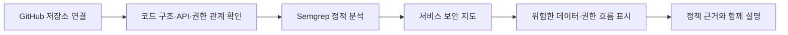

# VibeCheck 제출 요약

## 한 문장 소개

**VibeCheck는 AI로 만든 서비스의 데이터·권한 흐름을 사람이 읽을 수 있는 보안 지도로 보여주고, 코드 근거와 보안 규칙으로 위험을 확인하는 Human-in-the-loop Security Harness입니다.**

## 문제

바이브코딩은 코드를 만드는 속도는 높였지만, 개발자가 그 코드의 데이터·권한 흐름을 이해하고 검증하는 과정까지 자동화하지는 못했습니다.

그래서 개발자는 “어느 화면이 어떤 API를 호출하는지”, “개인정보가 어디로 가는지”, “권한 확인이 빠진 곳은 없는지”를 파일 목록과 보안 경고만 보고 직접 해석해야 합니다.

## 해결

VibeCheck는 공개 GitHub 저장소를 읽기 전용으로 분석하고 다음 순서로 결과를 만듭니다.



사용자는 파일 경로나 규칙 ID가 아니라 다음과 같은 결과를 먼저 봅니다.

- 개인정보가 콘솔에 노출될 수 있음
- 외부 주소로 데이터가 전달될 수 있음
- 권한 확인 없이 기능에 접근할 수 있음
- 외부 입력으로 파일에 접근할 수 있음

## 실제 동작하는 MVP

| 기능 | 현재 구현 | 확인 방법 |
| --- | --- | --- |
| 공개 GitHub 저장소 분석 | 실제 clone 후 코드 구조 분석 | URL 입력 후 파일·기능·관계 추출 |
| 서비스 보안 지도 | 화면·권한·API·데이터·외부 연동을 노드/edge로 표현 | 분석 결과 화면 |
| 정적 보안 분석 | Semgrep 실제 실행 | 분석 로그와 위험 edge |
| 회사 정책 근거 | TXT/MD/JSON 문서 업로드 후 관련 문단 검색 | 정책 근거 영역 |
| 로컬 요청 검증 | 승인된 테스트 환경의 HTTP 증거·규칙 판정·재실행 | `npm test` |
| 사람 승인 | 수정 전 증거를 확인한 뒤 승인하는 흐름 | 해결 방법 화면 |

> 공개 GitHub 저장소 분석은 읽기 전용입니다. 외부 서비스에 임의의 공격 요청을 보내지 않습니다.

## 실제 화면

MVP 화면은 시작 → 분석 진행 → 서비스 보안 지도 결과 순서로 구성됩니다. 각 단계는 로컬 실행 화면에서 직접 확인할 수 있습니다.

## 접속 및 실행

현재 MVP는 로컬에서 실행합니다.

```bash
npm install
npm run setup:semgrep
npm start
```

접속 주소: [http://localhost:3000](http://localhost:3000)

검증 명령:

```bash
npm test
```

## 제출물 구성

- [90초 데모 영상 대본](DEMO_VIDEO_SCRIPT.md)
- [Codex Build Log](CODEX_BUILD_LOG.md)
- [Value & Viability](VALUE_AND_VIABILITY.md)
- [비개발자용 제품 설명](../README.md)
