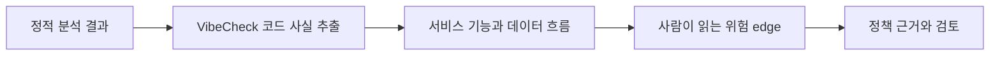
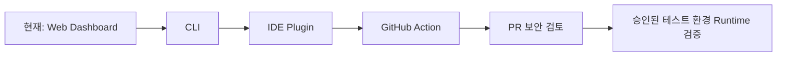

# Value & Viability

## 대상 사용자

### 1차 사용자: 바이브코딩 개발자

AI 도구로 웹·앱을 빠르게 만들지만, 보안 전문가가 아니어서 권한·개인정보·외부 연동 흐름을 직접 검토하기 어려운 개발자입니다.

### 2차 사용자: 초기 스타트업과 소규모 제품팀

보안 전담 인력이 없거나 제한적인 팀입니다. 배포 전 최소한의 보안 검토를 하고 싶지만, 복잡한 보안 보고서를 해석할 시간과 경험이 부족합니다.

### 3차 사용자: 보안 검토를 지원하는 조직

개발팀의 PR과 저장소를 빠르게 1차 분류하고, 사람이 검토해야 하는 흐름을 우선순위화하려는 보안·플랫폼 팀입니다.

## 기대 가치

| 사용자 문제 | VibeCheck가 주는 가치 |
| --- | --- |
| 코드가 빨리 늘어나 구조를 이해하기 어려움 | 파일 목록 대신 기능과 정보 흐름을 보안 지도로 제공 |
| 취약점 이름과 규칙 ID가 어려움 | 위험을 자연어로 설명하고 상세 근거는 클릭 뒤에 제공 |
| 정적 분석 결과가 너무 많음 | 위험 가능성이 있는 edge에 분석 결과를 연결 |
| 자동 수정이 불안함 | 증거를 보고 사람이 승인한 뒤에만 수정·재검증 |
| 팀 정책이 코드 검토에 반영되지 않음 | 회사 정책 문서를 결과 설명의 근거로 연결 |

## 차별점

일반 정적 분석 도구는 “어느 파일의 몇 번째 줄이 규칙에 걸렸는지”를 중심으로 보여줍니다. VibeCheck는 그 결과를 서비스 기능과 데이터 이동으로 다시 해석합니다.

핵심은 “경고 목록”이 아니라 **내 서비스에서 실제로 위험할 수 있는 길**을 보여주는 것입니다.

## 운영 가능성

### 안전 범위

- 공개 GitHub 저장소는 읽기 전용으로 분석합니다.
- 외부 웹사이트에 자동 공격 요청을 보내지 않습니다.
- 실제 요청 검증은 소유 또는 승인된 테스트 환경에서만 수행합니다.
- 자동 수정은 사람의 승인 이후에만 적용하는 구조를 유지합니다.

### 기술 운영

- Node.js 서버로 웹 화면과 분석 API를 제공합니다.
- Semgrep은 프로젝트 내부에 설치해 실행하며, 결과가 없으면 결과를 꾸며내지 않습니다.
- Cytoscape.js로 대화형 서비스 보안 지도를 렌더링합니다.
- 회사 정책 문서는 현재 로컬 문단 검색 방식으로 다루며, 의미 기반 검색은 확장 단계입니다.

### 비용과 확장성

초기 분석은 공개 저장소 clone, 코드 사실 추출, Semgrep 실행으로 구성되어 있어 외부 LLM 호출을 필수로 하지 않습니다. 따라서 기본 분석 비용을 낮추고, 사람이 더 깊은 설명이나 수정안을 요청할 때만 AI 사용량을 추가하는 방향으로 운영할 수 있습니다.

## 행사 이후 발전 계획

### 1단계 — CLI

`vibecheck analyze`로 현재 저장소에서 분석을 실행하고, 서비스 보안 지도 데이터를 생성합니다.

### 2단계 — IDE Plugin

VS Code/Cursor에서 분석 명령과 위험 edge를 확인합니다. 개발자가 코드를 작성하는 위치에서 관련 기능·데이터 흐름·수정 근거를 볼 수 있게 합니다.

### 3단계 — GitHub Action

Pull Request마다 분석을 실행해 새로 생긴 위험 edge를 PR 검토 화면에 남깁니다.

### 4단계 — 승인된 Runtime 검증

사용자가 소유 또는 테스트 권한을 명시한 staging 환경에 한해, 코드 분석과 실제 요청 검증을 연결합니다.

## 협업 제출 전 채울 항목

아래 표는 실제 팀원 이름과 역할로 교체해 제출합니다.

| 역할 | 담당 | 대표 산출물 |
| --- | --- | --- |
| 제품·문제 정의 | [팀원 이름] | 사용자 문제, 가치 제안, 발표 흐름 |
| UX·시각 설계 | [팀원 이름] | 홈·분석·서비스 보안 지도 화면 |
| 분석·백엔드 | [팀원 이름] | 저장소 분석, Semgrep, 보안 지도 데이터 |
| 검증·발표 | [팀원 이름] | 테스트, Build Log, 데모 영상 |
