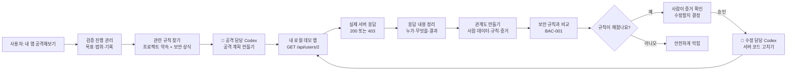
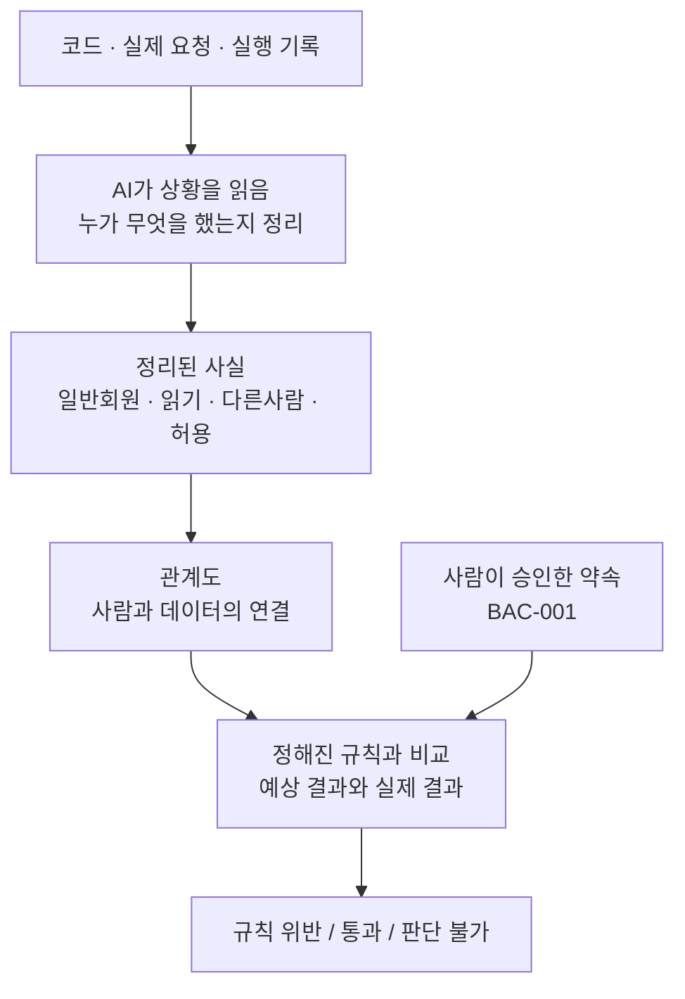
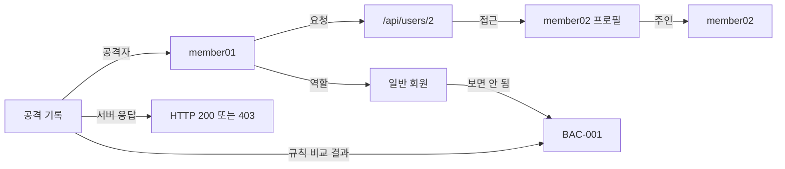
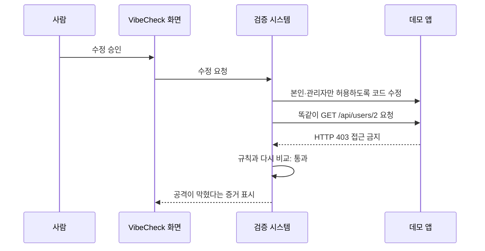

# VibeCheck는 어떻게 안전을 확인하나요?

VibeCheck는 “안전해 보입니다”라고 말하는 도구가 아닙니다. 실제로 다른 사람의 정보를 요청해 보고, 결과를 규칙과 비교한 뒤, 사람이 승인한 수정만 적용하고, 같은 요청으로 다시 확인합니다.

## 처음부터 끝까지 흐름

## AI가 하는 일과 규칙이 하는 일

현재 AI 역할은 실제 요청 결과를 “일반 회원이 다른 회원 정보를 읽었고, 서버가 허용했다”처럼 정리하는 것입니다. 최종 결론은 AI가 내리지 않습니다. `core/verifier.js`가 승인된 규칙과 실제 결과를 기계적으로 비교해 판단합니다.

## 관계도는 무엇을 보여주나요?

이 그림은 장식이 아닙니다. 시스템은 `member01`과 `member02`가 다른 사람인지, 일반 회원이 다른 회원 정보를 읽었는지, 서버가 허용했는지를 연결해 보안 규칙을 비교합니다.

## 수정 후에는 꼭 같은 공격을 다시 합니다

