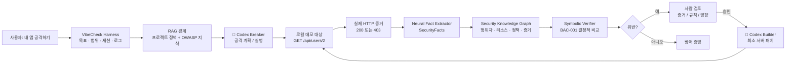
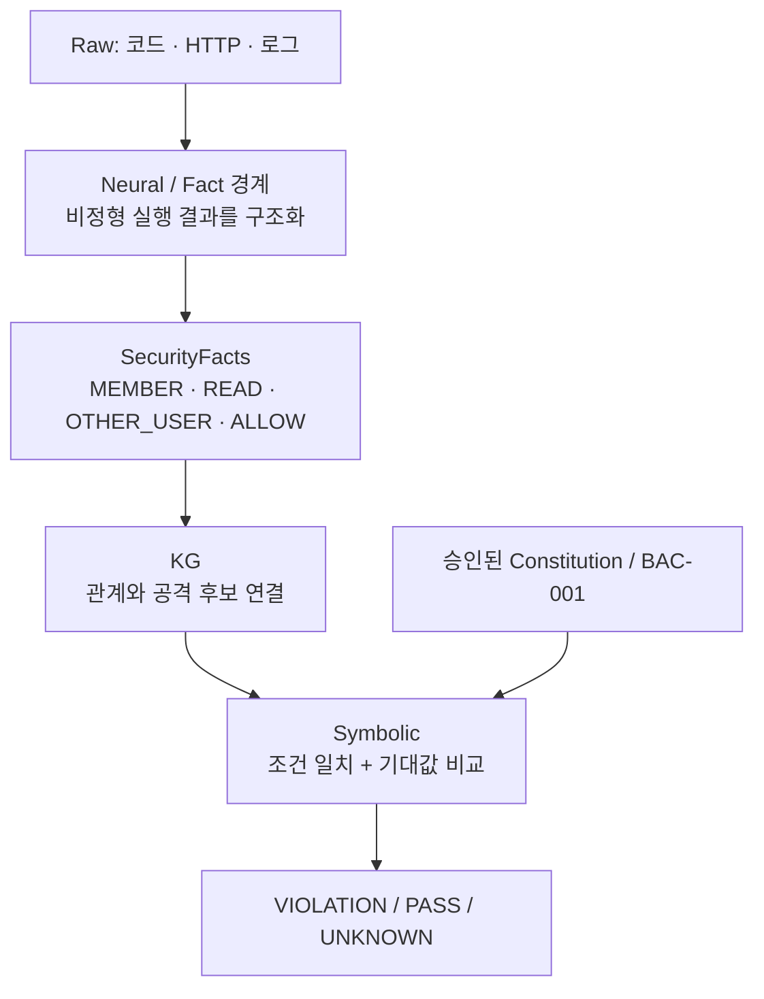
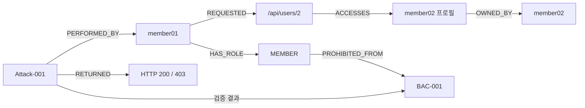
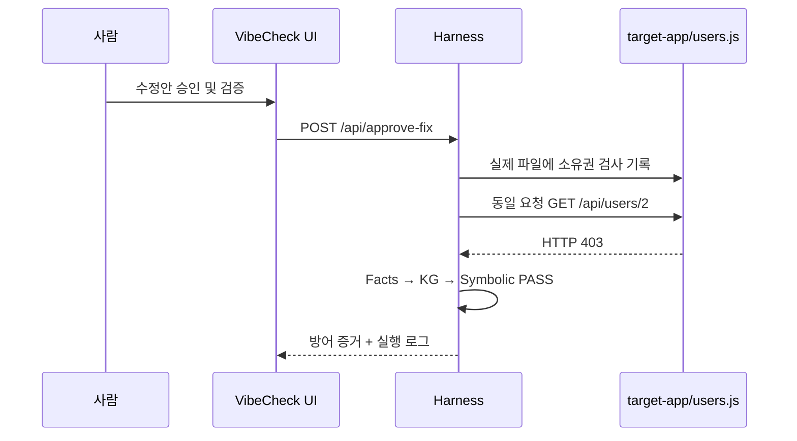

# VibeCheck 아키텍처

## 폐쇄 루프 보안 하네스

## NeSy 책임 분리

`core/facts.js`는 향후 학습된 사실 추출 모델로 교체할 수 있는 경계입니다. 현재는 실제 HTTP 증거를 안전하게 구조화하는 결정적 fallback입니다. 최종 판정은 절대 모델이 아닌 `core/verifier.js`의 규칙 비교가 수행합니다.

## KG가 하는 일

그래프는 화면용 장식이 아닙니다. `core/kg.js`는 사실과 실제 HTTP 결과를 결합해 `MEMBER ∧ OTHER_USER ∧ READ ∧ HTTP 200 → BAC-001 VIOLATION`이라는 공격 우선순위/판단 근거를 만들고, 이 결과가 대시보드와 하네스 결과에 사용됩니다.

## 패치와 재실행

